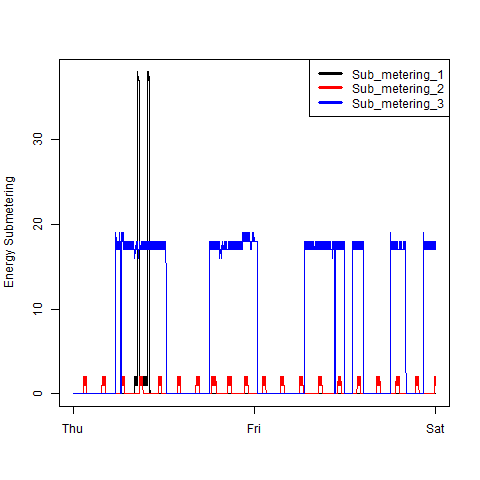
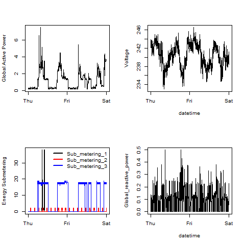

## Overview

This assignment uses data from the <a href="http://archive.ics.uci.edu/ml/">UC Irvine Machine Learning Repository</a>. In particular, the "Individual household electric power consumption Data Set" is used:

* <b>Dataset</b>: <a href="https://d396qusza40orc.cloudfront.net/exdata%2Fdata%2Fhousehold_power_consumption.zip">Electric power consumption</a> [20Mb]

* <b>Description</b>: Measurements of electric power consumption in one household with a one-minute sampling rate over a period of almost 4 years. Different electrical quantities and some sub-metering values are available.

The following descriptions of the 9 variables in the dataset are taken from the 
<a href="https://archive.ics.uci.edu/ml/datasets/Individual+household+electric+power+consumption">
UCI web site</a>:

<ol>
<li><b>Date</b>: Date in format dd/mm/yyyy </li>
<li><b>Time</b>: time in format hh:mm:ss </li>
<li><b>Global_active_power</b>: household global minute-averaged active power (in kilowatt) </li>
<li><b>Global_reactive_power</b>: household global minute-averaged reactive power (in kilowatt) </li>
<li><b>Voltage</b>: minute-averaged voltage (in volt) </li>
<li><b>Global_intensity</b>: household global minute-averaged current intensity (in ampere) </li>
<li><b>Sub_metering_1</b>: energy sub-metering No. 1 (in watt-hour of active energy). It corresponds to the kitchen, containing mainly a dishwasher, an oven and a microwave (hot plates are not electric but gas powered). </li>
<li><b>Sub_metering_2</b>: energy sub-metering No. 2 (in watt-hour of active energy). It corresponds to the laundry room, containing a washing-machine, a tumble-drier, a refrigerator and a light. </li>
<li><b>Sub_metering_3</b>: energy sub-metering No. 3 (in watt-hour of active energy). It corresponds to an electric water-heater and an air-conditioner.</li>
</ol>

## Loading the data

* The time frame used for analysis is 2007-02-01 and 2007-02-02. 

## Making Plots

* The generated plots are PNG files with a width of 480 pixels and a height of 480 pixels.

* The plots are "plot1.png", "plot2.png", "plot3.png", "plot3.png" and "plot4.png"

* The corresponding scripts are "plot1.R", "plot2.R", "plot3.R", "plot3.R" and "plot4.R"

* The scripts <b>assume the data txt file is contained in the same dorectiry as the scripts.</b>

* The scripts generate PNG plots into the same folder as scripts.

## The four plots are: 

### Plot 1
 

### Plot 2
 

### Plot 3
 

### Plot 4
 

